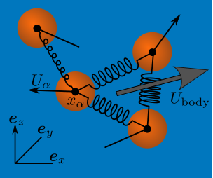

Abstract
---

The well-known self-propulsion, or swimming, of a deformable body in Stokes flow (i.e. at low Reynolds number) can be understood and modelled from the variation in the configuration-dependent hydrodynamic resistance tensor throughout the period of deformation. Remarkably, at the other extreme of high Reynolds number, a deformable body may also self-propel without doing any net work on the fluid in potential flow. As a body deforms, the mass of fluid displaced – the so-called added mass – depends on the instantaneous body configuration, and a net displacement is possible over a period of deformation. This potential swimming takes a form identical to that for Stokes swimmers with the configuration-dependent added mass replacing the hydrodynamic resistance tensor. Analytical insight into the swimming of a deformable body is obtained through an expansion of the nonlinear spatial dependence of the hydrodynamic interactions and connections between previous studies of swimming in Stokes flow to those in potential flow are made.

[Download paper here](http://alec-glisman.github.io/files/JFM.952.R5.pdf)

Recommended citation: Alec Glisman, and John F. Brady (2022). "Swimming in potential Flow." JFM. 952(R5).

Figure 1
---

A schematic of N spherical particles connected together to form a deformable body.
Each particle α is parametrized by its position xα and velocity Uα.
In general, the particle motion results in a net body velocity Ubody.
